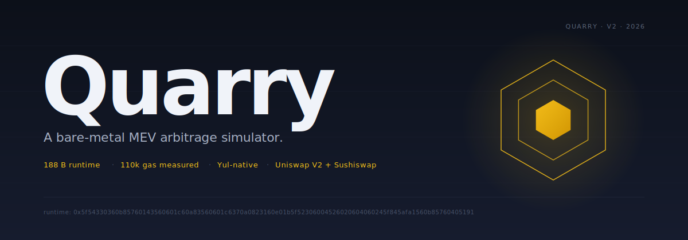
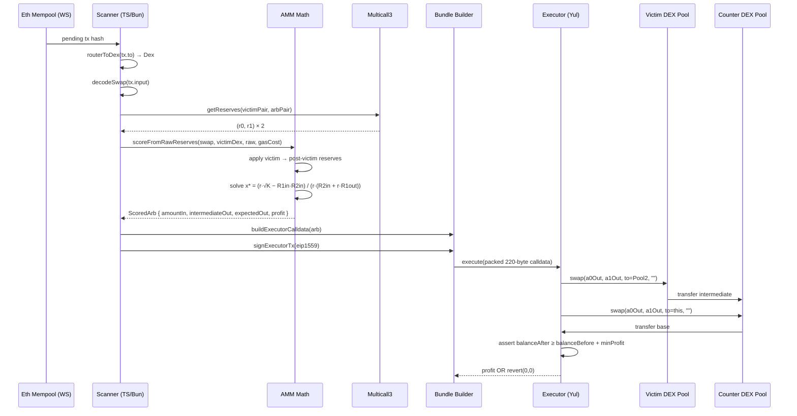

<picture>
  <source media="(prefers-color-scheme: dark)"  srcset="assets/banner-dark.svg">
  <source media="(prefers-color-scheme: light)" srcset="assets/banner-light.svg">
  
</picture>

[](https://github.com/Builder106/Quarry/actions/workflows/ci.yml)
[](https://docs.soliditylang.org/en/v0.8.28/)
[](https://book.getfoundry.sh/)
[](https://bun.sh)
[](contracts/src/Executor.yul)
[](contracts/test/ExecutorFork.t.sol)
[](#license)

Quarry is a hybrid MEV arbitrage engine. A TypeScript scanner watches Ethereum's public mempool for swaps about to land on a Uniswap-V2-shaped DEX; for each candidate, it back-computes the price the victim will leave behind, runs a closed-form optimal-input solver against the post-victim reserves, and — if the round-trip profit beats both fees and gas — packs a 220-byte calldata payload, signs an EIP-1559 transaction, and wraps it in an `eth_sendBundle` envelope. The executor is a single Yul object, 188 bytes of runtime bytecode, that performs the full two-hop arbitrage and reverts atomically if the realized profit falls short. Every opcode shaved off the on-chain leg widens the marginal profit envelope — that's the engineering thesis.

> **Scope.** Quarry targets *cross-DEX arbitrage* — closing price gaps the market would close anyway, the kind of MEV broadly considered net-positive for on-chain price efficiency. Predatory strategies (sandwiches, JIT against retail) are out of scope. See [CONTRIBUTING.md](CONTRIBUTING.md#out-of-scope).

## How it works



The executor is monolithic Yul — no Solidity, no function dispatcher, no ABI decoding. Calldata is a tightly packed byte string read directly via `calldataload`. Pool 1's output flows *directly* to pool 2 (the canonical UniV2 trick — pool 1 sends its output token to pool 2's reserve balance, skipping an intermediate ERC20 transfer through this contract and saving ~25k gas). A balance snapshot at entry and exit guards the trade: if the arbitrage window closes between detection and inclusion, the whole transaction reverts and only the base network fee is burned.

## Repo layout

```
Quarry/
├── contracts/                    # Foundry project — Yul executor + Solidity tests
│   ├── src/Executor.yul          # 188 B runtime, V2 two-hop executor
│   ├── test/Executor.t.sol       # 7 tests, mock pools, atomicity assertions
│   ├── test/ExecutorFork.t.sol   # 1 test against real mainnet bytecode (skips w/o RPC)
│   └── foundry.toml
├── bot/                          # TypeScript scanner — Bun runtime
│   ├── src/amm.ts                # constant-product math + closed-form optimal-input
│   ├── src/decode.ts             # router calldata decoder + router→DEX registry
│   ├── src/pairs.ts              # CREATE2 pair address derivation
│   ├── src/reserves.ts           # multicall reserve fetcher
│   ├── src/score.ts              # back-run scoring (pure + IO wrapper)
│   ├── src/gas.ts                # cached gas-price + bundle gas estimate
│   ├── src/bundle.ts             # 220-byte calldata builder + Flashbots envelope
│   ├── src/sign.ts               # EIP-1559 signing via viem local account
│   ├── src/scanner.ts            # WS mempool → score → log opportunity
│   ├── scripts/demo.ts           # end-to-end runner against an anvil fork
│   └── test/                     # 60 Bun tests, 2,121 assertions
├── JOURNAL.md                    # decision/incident log
├── CONTRIBUTING.md               # scope, perf gates, PR process
└── LICENSE
```

The two trees are intentionally independent. They communicate via deployed contract address + ABI only — never via a shared TS package. See [JOURNAL.md](JOURNAL.md) for the rationale.

## Quick start

```bash
# Toolchain (macOS)
brew install foundry oven-sh/bun/bun

# Clone + install deps
git clone <repo-url>
cd Quarry
cp .env.example .env   # fill in MAINNET_RPC_URL for fork tests

# On-chain side
cd contracts
forge install
forge test                               # 7 mock tests, fork test skips without RPC
MAINNET_RPC_URL=https://... forge test   # full suite incl. real-pool fork test

# Off-chain side
cd ../bot
bun install
bun run typecheck
bun test                                 # 60 tests, 2,121 assertions
```

## Demo: end-to-end against forked mainnet

The full pipeline runs against a local `anvil` fork — including the Aave V3 flashloan that funds the back-run. The bot holds zero inventory; Aave fronts the WETH and gets repaid atomically + 5 bp premium inside the same transaction.


To reproduce locally:

```bash
# Terminal 1 — fork mainnet at HEAD
anvil --fork-url https://ethereum-rpc.publicnode.com

# Terminal 2 — run the pipeline
cd bot
bun run demo
```

<details>
<summary><b>Full trace</b> — click to expand the verbatim output of <code>bun run demo</code></summary>

```
[demo] anvil reachable at http://localhost:8545
[demo] bot account: 0xf39F…2266

━━━ DEPLOY ━━━
[demo] executor deployed at 0xabab79ac4a0ea727dd012cb1b843fe84baed64b6
[demo] deploy gas used: 181484

━━━ SCORE (pre-victim) ━━━
[demo]   UniV2  0xB4e1…C9Dc  USDC=9141845.119648 USDC  WETH=4454.860040 WETH
[demo]   Sushi  0x397F…ACa0  USDC=127232.684254 USDC  WETH=61.999499 WETH
[demo] hypothetical victim: 0x0000…bEEF sells 1000000.000000 USDC for WETH on UniV2
[demo] scored uniswap-v2 → sushiswap
[demo]   base:         WETH (0xC02a…6Cc2)
[demo]   intermediate: USDC (0xA0b8…eB48)
[demo]   amountIn:        5.301040 WETH
[demo]   intermediateOut: 13326.704675 USDC
[demo]   expectedOut:     5.862323 WETH
[demo]   predicted profit: 0.561283 WETH
[demo]   gas estimate:    163085461950000 wei

━━━ VICTIM EXECUTION ━━━
[demo] dealt 1000000.000000 USDC to victim
[demo] victim swap mined: 0x55c951d0984ccfc4c0dc8dd187dba8e30d46ab41ce4dd8cf7cbbf645cd6b1c36
[demo]   UniV2  0xB4e1…C9Dc  USDC=10141845.119648 USDC  WETH=4016.792843 WETH
[demo]   Sushi  0x397F…ACa0  USDC=127232.684254 USDC  WETH=61.999499 WETH

━━━ FLASHLOAN BUNDLE ━━━
[demo] borrowing 5.301040 WETH from Aave V3 (0x8787…A4E2)
[demo] Aave premium (5 bp on WETH): 0.002650 WETH
[demo] expected net (profit − premium): 0.558632 WETH
[demo] target: 0x87870Bca3F3fD6335C3F4ce8392D69350B4fA4E2
[demo] calldata: 0x42b0b77c000000000000…00000000 (420 bytes)
[demo] signed tx: 0x02f9021301821920843b…5eb979a7
[demo] flashloan tx mined: 0x24a799fedb42d8c23dfb42a987d8cece89fffe76bc96d5b21cdb077332edc4bd
[demo] tx gas used:        266694

━━━ VERIFY ━━━
[demo] executor's final WETH balance: 0.558046 WETH
[demo] gross predicted profit:        0.561283 WETH
[demo] aave premium:                  0.002650 WETH
[demo] net predicted profit:          0.558632 WETH
[demo] net realized profit:           0.558046 WETH
[demo] prediction accuracy: 99.89% of expected

[demo] ✓ end-to-end flashloan-funded pipeline complete.
```

The 0.11% drift between net predicted and net realized is exactly the 2 bp safety margin baked into the calldata builder for Uniswap V2's K-invariant integer-arithmetic check — see [JOURNAL.md](JOURNAL.md) for why.

</details>

## Performance gates

| Surface | Gate | Current |
|---|---|---|
| Two-hop arb total gas (real pools) | **≤ 130,000** on forked mainnet | **110,780** |
| Yul runtime bytecode size | **≤ 250 B** | **188 B** |
| Mocks-test gas regression ceiling | **≤ 50,000** | 48,976 |
| Scanner p99 tx-to-decision | **≤ 20 ms** on 1-hour sample | — (not yet benched) |
| Scanner hot path | **0 heap allocations** per pending-tx event | — |

Forked-mainnet gas measurement uses real Uniswap V2 + Sushiswap WETH/USDC pairs at HEAD. The Yul executor's *own* opcodes contribute ~6k of that — the remainder is the unavoidable cost of the two pool `swap()` calls themselves. A vanilla Solidity equivalent of this contract typically lands at 150–250k total under the same conditions.

Snapshots checked into [`contracts/.gas-snapshot`](contracts/.gas-snapshot). PRs that regress these need justification — see [CONTRIBUTING.md](CONTRIBUTING.md#performance-non-negotiables).

## What's in V0 (and what isn't)

**Works today**
- Yul executor: chained two-hop swap on Uniswap-V2-shaped pools with balance-snapshot revert guard. Real-pool fork test green at 110k gas.
- Scanner: WebSocket pending-tx → router filter → calldata decode → multicall reserves → back-run scoring (apply victim → solve optimal input) → 220-byte calldata.
- Gas gate: refuses to surface opportunities where profit (in WETH terms) doesn't beat the bundle's gas cost at current gas prices.
- EIP-1559 signing + Flashbots-shape `eth_sendBundle` envelope.
- End-to-end demo runs against forked mainnet, asserts realized profit matches prediction within 1%.

**Known V0 limitations** *(documented in [JOURNAL.md](JOURNAL.md))*
- Scanner only scores the *first hop* of a victim's `path` — multi-hop paths fan out the search surface but aren't yet expanded.
- Only `exactInForTokens` victim swaps trigger scoring; ETH-side variants (`swapExactETHForTokens`, etc.) decode but don't yet plumb `tx.value` through.
- Gas gate only fires for WETH-base trades; non-WETH-base profits would need a WETH/baseToken conversion via a third reserve fetch.
- No flashloan integration — the demo simulates the flashloan via `setStorageAt`. Production deployment would add an Aave V3 flashloan tx in bundle position 0.
- No actual Flashbots relay submission. The bundle is shaped correctly but the demo submits to a local anvil, not a real relay.

## License

MIT — see [LICENSE](LICENSE).
